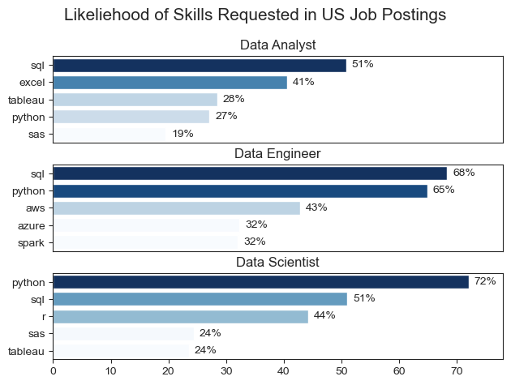
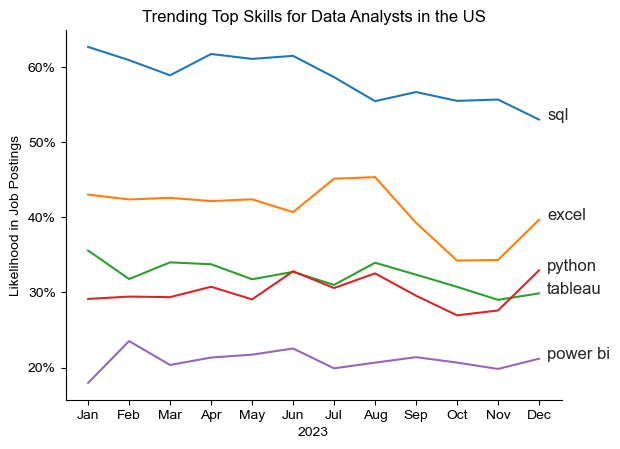
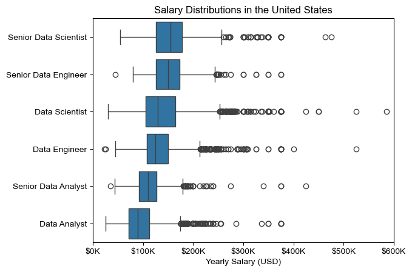
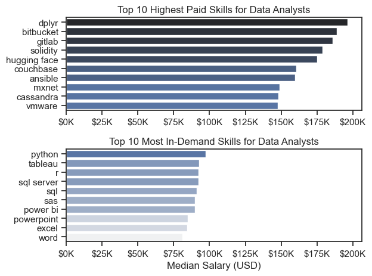
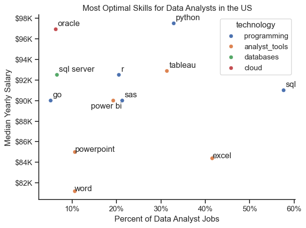

# Python Data Analyst Job Market Analysis

# Table of Contents

- [Overview](#overview)  
- [The Questions](#the-questions)  
- [Tools I Used](#tools-i-used)  
- [Data Preparation and Cleanup](#data-preparation-and-cleanup)  
- [The Analysis](#the-analysis)  
- [What I Learned](#what-i-learned)  
- [Insights](#insights)  
- [Challenges I Faced](#challenges-i-faced)  
- [Conclusion](#conclusion)
- [References](#references) 

# Overview

This project explores the landscape of the data job market with a focus on data analyst roles. The aim is to better understand market dynamics, identify high-demand skills, and uncover which capabilities lead to the most competitive salaries.  

The dataset includes detailed information on job titles, salaries, locations, and required skills. Using Python, I conducted a series of analyses to answer key questions such as:  

- Which skills are most in demand for data analysts?  
- How do salaries vary across roles and regions?  
- Where do skill demand and high salary potential intersect?  

The findings are presented through structured analysis and visualizations to provide insight into navigating the data analytics job market more effectively.

# The Questions

This project is driven by a set of guiding questions aimed at uncovering insights about the data job market, with an emphasis on data analyst roles:

1. What are the skills most in demand for the top 3 most popular data roles?  
2. How are in-demand skills trending for Data Analysts?  
3. How well do jobs and skills pay for Data Analysts?  
4. What are the optimal skills for data analysts to learn? (High Demand AND High Paying)  

# Tools I Used

To analyze the data analyst job market, I relied on a combination of programming tools and development environments:

- **Python:** The core language powering the analysis, used to clean, explore, and extract insights from the dataset.  
  - **Pandas:** For data wrangling and analysis.  
  - **Matplotlib:** For building clear, insightful visualizations.  
  - **Seaborn:** For advanced and aesthetically refined visualizations.  
- **Jupyter Notebooks:** For running Python code alongside documentation, enabling a seamless mix of analysis and narrative.  
- **Visual Studio Code:** For executing scripts and managing the overall workflow.  
- **Git & GitHub:** For version control and sharing the project, ensuring transparency, reproducibility, and easy collaboration.  

# Data Preparation and Cleanup

Before diving into the analysis, the dataset was carefully prepared to ensure accuracy, consistency, and usability. This involved cleaning and structuring the data so that it could be effectively explored and visualized in later steps.  


## Import & Clean Up Data

The process began with importing the required Python libraries and loading the dataset. Initial cleaning steps were then applied to improve data quality, including handling inconsistencies and preparing the data for deeper analysis.  

<details>
<summary>Show/Hide Code</summary>

```python
# Importing Libraries
import ast
import pandas as pd
import seaborn as sns
import matplotlib.pyplot as plt 

# Load Dataset
df = pd.read_csv(r'D:\Data_Science\Projects\Python_Data_Analyst_Job_Market_Analysis\Dataset\data_jobs.csv')

# Data Cleanup
df['job_posted_date'] = pd.to_datetime(df['job_posted_date'])
df['job_skills'] = df['job_skills'].apply(lambda x: ast.literal_eval(x) if pd.notna(x) else x)
```
</details>

## Filter US Jobs

To concentrate the analysis on the U.S. job market, filters were applied to isolate job postings located within the United States. This step ensured that insights were relevant to the U.S. data analyst landscape. 

<details>
<summary>Show/Hide Code</summary>

```python
df_US = df[df['job_country'] == 'United States']

```
</details>

# The Analysis

The analysis is organized into Jupyter notebooks, each designed to investigate a specific aspect of the data job market. Every notebook tackles one of the guiding questions, combining data exploration with visualizations to highlight key findings.  

## 1. What are the most demanded skills for the top 3 most popular data roles?

To uncover the most in-demand skills, I first identified the three most common job titles in the dataset. From there, I extracted the top five skills for each of these roles.  
This analysis highlights the core skill sets most frequently requested by employers, helping identify which skills are worth prioritizing depending on the role being targeted.  

Detailed steps can be found in the notebook: [2_Skill_Demand](2_Skill_Demand.ipynb).  

### Visualize Data
<details>
<summary>Show/Hide Code</summary>

```python
# Plot: Top Skills per Role (Percentages)
fig, ax = plt.subplots(len(job_titles), 1)

sns.set_style('ticks')

for i, job_title in enumerate(job_titles):
    df_plot = df_skills_perc[df_skills_perc['job_title_short'] == job_title].head(5)
    sns.barplot(data=df_plot, x='skill_percent', y='job_skills', ax=ax[i], hue='skill_count', palette='dark:b_r')

    ax[i].set_title(job_title)
    ax[i].set_ylabel('')
    ax[i].set_xlabel('')
    ax[i].get_legend().remove()
    ax[i].set_xlim(0, 78)

    for n, v in enumerate(df_plot['skill_percent']):
        ax[i].text(v + 1, n, f'{v:.0f}%', va='center')

    if i != len(job_titles) - 1:
        ax[i].set_xticks([])
            
fig.suptitle('Likeliehood of Skills Requested in US Job Postings', fontsize=15)
fig.tight_layout(h_pad=0.5)
plt.show()
```
</details>

### Results



*Bar chart showing the top five skills associated with the three most common data roles in the U.S. job market, highlighting which skills are most frequently requested by employers.*  

### Insights

- **SQL** stands out as the most requested skill for both Data Analysts and Data Scientists, appearing in over half of all job postings for these roles.  
- Data Engineers are expected to master more specialized technical tools such as **AWS, Azure, and Spark**, while Data Analysts and Data Scientists are more often required to be proficient in general-purpose tools like **Excel** and **Tableau**.  
- **Python** dominates for Data Engineers, showing up in 68% of postings, and is also highly valued across all roles—most notably for Data Scientists (72%) and Data Engineers (65%).  

## 2. How are in-demand skills trending for Data Analysts?

To track how demand for skills evolved over time in 2023, I focused specifically on data analyst positions. The skills were grouped by the month of each job posting, which revealed the top five skills for data analysts each month.  
This approach highlights shifts in employer preferences and shows which skills maintained consistent demand throughout the year.  

Detailed steps can be found in the notebook: [3_Skills_Trend](3_Skills_Trend.ipynb).  

### Visualize Data
<details>
<summary>Show/Hide Code</summary>

```python
# Plot: Skill Trends
sns.lineplot(data=df_plot, dashes=False, palette='tab10')
sns.set_theme(style='ticks')
sns.despine()

plt.title('Trending Top Skills for Data Analysts in the US')
plt.ylabel('Likelihood in Job Postings')
plt.xlabel('2023')
plt.legend().remove()

from matplotlib.ticker import PercentFormatter
ax = plt.gca()
ax.yaxis.set_major_formatter(PercentFormatter(decimals=0))

for i in range(5):
    plt.text(11.2, df_plot.iloc[-1, i], df_plot.columns[i])
```
</details>

### Results
 

*Bar chart showing how the top five skills for U.S. Data Analysts shifted month by month in 2023, revealing patterns in employer demand.*  

### Insights

- **SQL** remained the most consistently demanded skill across 2023, though it showed a gradual decline in frequency over the year.  
- **Excel** saw a notable surge in demand starting in September, eventually surpassing both Python and Tableau by year’s end.  
- **Python** and **Tableau** maintained relatively stable demand with minor fluctuations, reinforcing their role as core skills for data analysts.  
- **Power BI**, while less prominent overall, displayed a steady upward trend toward the end of the year, signaling growing importance.  

## 3. How well do jobs and skills pay for Data Analysts?

To understand compensation patterns, I focused on U.S.-based roles and analyzed their median salaries. As a first step, I examined salary distributions for common positions such as Data Scientist, Data Engineer, and Data Analyst to establish a baseline comparison of pay across roles.  
From there, I identified which specific skills were most strongly associated with higher-paying jobs.  

Detailed steps can be found in the notebook: [4_Salary_Analysis](4_Salary_Analysis.ipynb).  

#### Visualize Data 
<details>
<summary>Show/Hide Code</summary>

```python
# Plot: Salary Distributions by Role
sns.boxplot(data=df_US_top6, x='salary_year_avg', y='job_title_short', order=job_order)
sns.set_theme(style='ticks')

plt.title('Salary Distributions in the United States')
plt.xlabel('Yearly Salary (USD)')
plt.ylabel('')
plt.xlim(0, 600000) 
ticks_x = plt.FuncFormatter(lambda y, pos: f'${int(y/1000)}K')
plt.gca().xaxis.set_major_formatter(ticks_x)
plt.show()
```
</details>

#### Results
 


*Box plot comparing salary distributions across the six most common U.S. data job titles, highlighting differences in pay ranges.*  

#### Insights

- Salaries vary widely across job titles. **Senior Data Scientist** roles show the highest earning potential, reaching up to $600K, underscoring the industry’s high valuation of advanced expertise and experience.  
- **Senior Data Engineer** and **Senior Data Scientist** positions include many high-end outliers, suggesting that exceptional skill sets or unique circumstances can command premium compensation.  
- **Data Analyst** salaries, by contrast, display less variability and fewer extreme outliers, reflecting more consistent pay ranges.  
- Median salaries rise with both **seniority** and **specialization**—senior roles not only earn more on average but also show greater variance in pay, highlighting the diverse opportunities available at advanced levels.  

### Highest Paid & Most Demanded Skills for Data Analysts

Focusing specifically on data analyst roles, I examined which skills command the highest salaries and which are most frequently requested by employers.  
The results are visualized through two bar charts—one highlighting the top-paying skills and the other showcasing the most in-demand skills for data analysts.  

#### Visualize Data
<details>
<summary>Show/Hide Code</summary>

```python
# Plot: Top Skills (Pay vs Demand)
fig, ax = plt.subplots(2, 1)  

sns.set_theme(style='ticks')

# Top-paid skills
sns.barplot(data=df_DA_top_pay, x='median', y=df_DA_top_pay.index, hue='median', ax=ax[0], palette='dark:b_r')
ax[0].legend().remove()
ax[0].set_title('Top 10 Highest Paid Skills for Data Analysts')
ax[0].set_ylabel('')
ax[0].set_xlabel('')
ax[0].xaxis.set_major_formatter(plt.FuncFormatter(lambda x, _: f'${int(x/1000)}K'))

# Most in-demand skills
sns.barplot(data=df_DA_skills, x='median', y=df_DA_skills.index, hue='median', ax=ax[1], palette='light:b')
ax[1].legend().remove()
ax[1].set_title('Top 10 Most In-Demand Skills for Data Analysts')
ax[1].set_ylabel('')
ax[1].set_xlabel('Median Salary (USD)')
ax[1].set_xlim(ax[0].get_xlim())  # Set the same x-axis limits as the first plot
ax[1].xaxis.set_major_formatter(plt.FuncFormatter(lambda x, _: f'${int(x/1000)}K'))

plt.tight_layout()
plt.show()
```
</details> 

#### Results  

The analysis reveals the contrast between skills that are most frequently requested and those that command the highest salaries for data analyst roles in the U.S.:  
 


*Two bar charts comparing the highest-paying skills with the most in-demand skills for U.S. data analysts.*  

#### Insights

- Specialized technical skills such as **dplyr**, **Bitbucket**, and **GitLab** are tied to higher salaries—some reaching up to $200K—indicating that advanced technical expertise can significantly boost earning potential.  
- Foundational tools like **Excel**, **PowerPoint**, and **SQL** dominate in-demand skills, underscoring their critical role in employability even if they don’t command the highest pay.  
- A clear divide exists between the skills that pay the most and those most frequently requested. To maximize career potential, data analysts should cultivate a mix of **high-paying specialized skills** alongside **widely demanded core skills**.  

## 4. What are the most optimal skills to learn for Data Analysts?

To uncover the most optimal skills for data analysts—those that are both highly paid and highly in demand—I combined two measures:  
- The percentage of job postings requesting each skill.  
- The median salary associated with those skills.  

This approach makes it easier to identify which skills provide the best balance between market demand and earning potential.  

Detailed steps can be found in the notebook: [5_Optimal_Skills](5_Optimal_Skills.ipynb).  


#### Visualize Data

<details>
<summary>Show/Hide Code</summary>

```python
# Scatter Plot: Demand vs Salary
from adjustText import adjust_text

df_DA_skills_high_demand.plot(kind='scatter', x='skill_percent', y='median_salary')

texts = []
for i, txt in enumerate(df_DA_skills_high_demand.index):
    texts.append(plt.text(df_DA_skills_high_demand['skill_percent'].iloc[i], df_DA_skills_high_demand['median_salary'].iloc[i], txt))

adjust_text(texts, arrowprops=dict(arrowstyle='->', color='gray'))

plt.xlabel('Percent of Data Analyst Jobs')
plt.ylabel('Median Yearly Salary')
plt.title('Most Optimal Skills for Data Analysts in the US')

from matplotlib.ticker import PercentFormatter
ax = plt.gca()
ax.yaxis.set_major_formatter(plt.FuncFormatter(lambda y, pos: f'${int(y/1000)}K'))
ax.xaxis.set_major_formatter(PercentFormatter(decimals=0))

plt.tight_layout()
plt.show()
```
</details>

#### Results  

    

*Scatter plot mapping data analyst skills by both demand and median salary, highlighting those that offer the best balance of high pay and high demand.*  

#### Insights 

- **Oracle** stands out with the highest median salary at nearly $97K, even though it appears less frequently in job postings—highlighting the premium placed on specialized database expertise.  
- Widely required skills such as **Excel** and **SQL** dominate job listings but are linked to lower median salaries compared to more specialized tools like **Python** and **Tableau**, which strike a stronger balance between prevalence and pay.  
- **Python**, **Tableau**, and **SQL Server** occupy a sweet spot of being both relatively common in postings and positioned toward the higher end of the salary spectrum, making them strong skill investments for data analysts.  

### Visualizing Different Technologies

This graph also visualizes technologies by category, using color labels to distinguish them (e.g., **Programming → Python**).  
Color-coding by technology family makes it easier to compare patterns across related tools at a glance.

#### Visualize Data

<details>
<summary>Show/Hide Code</summary>

```python
# Scatter Plot: Custom Label Offsets
sns.scatterplot(data=df_plot, x='skill_percent', y='median_salary', hue='technology')

sns.despine()
sns.set_theme(style='ticks')

offsets = {
    "power bi": (-5, -800),   # shift right/down
    "sas":      (0.5,  300),   
    "oracle":   (0.5,  300),   
    "python":   (0.5,  300),
    "tableau":  (0.5,  300),
    "sql":      (0.5,  300),
    "go":       (0.5,  300),
    "sql server":  (0.5,  300),
    "r":        (0.5,  300)
}

texts = []
for i, label in enumerate(df_DA_skills_high_demand.index):
    x = df_DA_skills_high_demand['skill_percent'].iloc[i]
    y = df_DA_skills_high_demand['median_salary'].iloc[i]

    dx, dy = offsets.get(label.lower(), (0, 0))  # shift only those in dict
    txt = plt.text(x + dx, y + dy, label, fontsize=12, zorder=10)
    texts.append(txt)

plt.xlabel('Percent of Data Analyst Jobs')
plt.ylabel('Median Yearly Salary')
plt.title('Most Optimal Skills for Data Analysts in the US')

from matplotlib.ticker import PercentFormatter
ax = plt.gca()
ax.yaxis.set_major_formatter(plt.FuncFormatter(lambda y, pos: f'${int(y/1000)}K'))
ax.xaxis.set_major_formatter(PercentFormatter(decimals=0))

plt.tight_layout()
plt.show()
```
</details>

#### Results  
 


*Scatter plot highlighting the most optimal skills for U.S. data analysts (high pay & high demand), color-coded by technology category for easier comparison.*  

#### Insights

- **Programming skills (blue)** like Python and R consistently sit at the higher salary range while maintaining moderate demand, showing that coding proficiency is both valuable and market-relevant.  
- **Database skills (green)** such as Oracle and SQL Server are less common in postings but deliver some of the very highest salaries, marking them as lucrative niche skills.  
- **Analyst tools (orange)** like Excel and PowerPoint dominate demand but trend toward lower salaries, while visualization tools like Tableau and Power BI balance strong prevalence with competitive pay—making them critical for employability even if they don’t match the top-paying categories.  

# What I Learned

This project not only gave me a clearer picture of the data analyst job market but also strengthened my technical and analytical abilities. Key takeaways include:  

- **Advanced Python Skills**: Gained hands-on experience with libraries like Pandas for data manipulation, and Seaborn/Matplotlib for building insightful visualizations, enabling more efficient and complex analyses.  
- **Value of Data Cleaning**: Reinforced the importance of thorough data preparation as the foundation for accurate, reliable insights.  
- **Linking Skills to Strategy**: Learned how to connect technical skills with market trends—recognizing how demand, salary potential, and job availability intersect can guide smarter career decisions in data analytics.  

# Insights

This project revealed several broader takeaways about the data job market for analysts:  

- **Skill Demand vs. Salary**: Specialized skills such as **Python** and **Oracle** are often associated with higher salaries, showing the strong economic value of advanced technical expertise.  
- **Shifting Market Trends**: Demand for tools and technologies changes over time, reflecting the evolving needs of the industry. Staying current with these trends is key for long-term career growth.  
- **Maximizing Value**: Knowing which skills are both widely sought after and well-compensated helps data analysts prioritize their learning and focus on the areas that deliver the greatest career returns.  

# Challenges I Faced

Like any real-world analysis, this project came with its share of hurdles—but each one offered valuable lessons:  

- **Data Inconsistencies**: Managing missing or inconsistent entries required careful cleaning strategies to maintain accuracy and reliability.  
- **Complex Visualizations**: Creating clear and impactful visuals for complex datasets was challenging, but essential for communicating insights effectively.  
- **Depth vs. Breadth**: Striking the right balance between drilling deep into specific analyses and keeping a broad view of the overall market was an ongoing challenge in scope and focus.  

# Conclusion

This project offered a deep dive into the data analyst job market, uncovering the skills, trends, and salary dynamics that define this evolving field. The findings not only strengthened my own understanding but also provide practical guidance for anyone aiming to grow a career in data analytics.  

As the market continues to shift, ongoing analysis will be vital for staying ahead. This work serves as a strong foundation for future explorations and reinforces the importance of continuous learning and adaptability in the world of data.  

# References

- Dataset: [data_jobs.csv](Dataset/data_jobs.csv) — includes job postings with titles, salaries, locations, and skills used in this analysis.  

